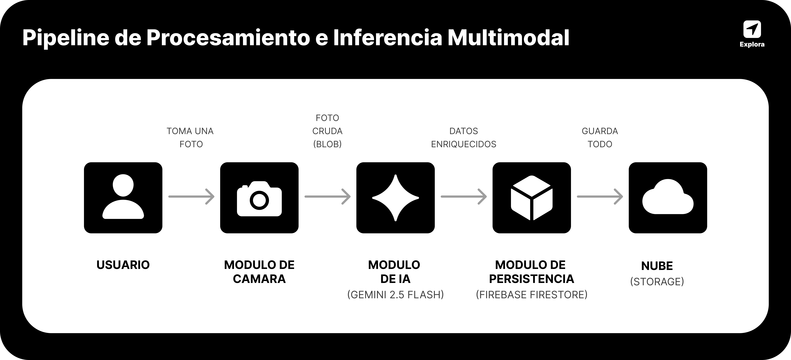

<div align="center">

</div>

---

<div align="center">

</div>

---

# Introducción

<div align="justify">

**Explora** es una aplicación móvil desarrollada para transformar la manera en que los usuarios descubren, guardan y comparten lugares de interés mediante una experiencia social inmersiva basada en geolocalización en tiempo real e inteligencia artificial.

La plataforma integra funcionalidades modernas como:

- Geolocalización GPS
- Visualización interactiva en mapas
- Registro multimedia de ubicaciones
- Reseñas, resumenes, edicion y analisis inteligente impulsado por IA
- Chat en tiempo real
- Grupos y comunidades
- Feed social colaborativo
- Sistema de guardados y favoritos

El objetivo principal de la aplicación es centralizar la experiencia de exploración urbana y social en un único ecosistema digital, permitiendo que los usuarios documenten experiencias, interactúen con comunidades y descubran contenido contextual basado en ubicación y asistido por IA.

</div>

---

# Propuesta de Valor

<div align="justify">

**Explora** redefine la forma en que interactuamos con nuestro entorno mediante la convergencia de **geolocalización inteligente** y un **sistema social integrado**, permitiendo un descubrimiento contextual de lugares con interacción comunitaria en tiempo real. Gracias a su capacidad de **registro multimedia**, los usuarios disfrutan de experiencias visuales enriquecidas bajo una **arquitectura móvil** moderna que garantiza fluidez, escalabilidad y una experiencia de usuario optimizada a través de una **interfaz intuitiva**.

</div>

---

# Pitch Visual

<div align="center">

</div>

<br />

<div align="justify">
  <h2> Vista Mapa: Flujo de Registro Inteligente</h2>
  <p>
    El núcleo de <strong>Explora</strong> es la capacidad de transformar coordenadas geográficas en historias visuales con el mínimo esfuerzo del usuario. A continuación, se detalla el flujo de trabajo integrado en la vista de mapa:
  </p>

  <h3>1. Ubicación y Contexto</h3>
  <p>
    El usuario interactúa con un mapa de alta precisión (estética minimalista) para identificar su posición actual o un punto de interés. Al seleccionar una ubicación, el sistema activa el botón dinámico de <b>"Registrar Ubicación"</b>, capturando las coordenadas exactas de forma automática.
  </p>

  <h3>2. Formulario Dinámico con BlurView</h3>
  <p>
    Al iniciar el registro, se despliega una interfaz de usuario optimizada mediante una tarjeta con efecto de desenfoque (<i>glassmorphism</i>). Este panel organiza la información técnica y los campos creativos:
  </p>
  <ul>
    <li><strong>Nombre y Descripción:</strong> Espacios para la personalización del usuario.</li>
    <li><strong>Gestión Multimedia:</strong> Selector de imágenes para documentar la experiencia.</li>
    <li><strong>Control de Privacidad:</strong> Interruptor nativo para decidir la visibilidad de la publicación.</li>
  </ul>

  <h3>3. Autocompletado con IA (Multimodal)</h3>
  <p>
    Mediante la integración con <b>Gemini AI</b>, el sistema ofrece un análisis automático de las fotografías:
  </p>
  <ul>
    <li><strong>Visión Computacional:</strong> Identificación de elementos clave (paisajes, flora, monumentos).</li>
    <li><strong>Generación de Contenido:</strong> Redacción automática de nombres creativos y descripciones detalladas.</li>
    <li><strong>Clasificación Inteligente:</strong> Generación de <i>#Hashtags</i> para facilitar la búsqueda y escalabilidad.</li>
  </ul>

  <h3>4. Publicación y Sincronización</h3>
  <p>
    Una vez validado, el registro se sincroniza con <b>Firebase Firestore</b>, apareciendo instantáneamente en el feed social y en la bitácora personal, garantizando fluidez bajo una arquitectura móvil moderna.
  </p>
</div>

<br />

<div align="center">

</div>

<br />

<div align="justify">
  <h2>Vista Explorar: Descubrimiento y Conexión Comunitaria</h2>
  <p>
    La sección <strong>Explorar</strong> actúa como el motor de descubrimiento de la plataforma, permitiendo a los usuarios conectar con experiencias compartidas por la comunidad a través de herramientas de búsqueda avanzada y análisis semántico. A continuación, se detalla el flujo de exploración:
  </p>

  <h3>1. Búsqueda y Filtrado Inteligente</h3>
  <p>
    La interfaz presenta un buscador global optimizado para nombres, categorías o etiquetas. Se implementa un sistema de <b>filtros rápidos (Chips)</b> que permiten segmentar resultados de forma instantánea: desde ubicaciones "Cerca de mí" hasta categorías específicas como #Naturaleza o #Cascada, facilitando una navegación fluida entre miles de registros.
  </p>

  <h3>2. Visualización de Resultados Dinámica</h3>
  <p>
    Los resultados se despliegan en una lista de tarjetas interactivas que priorizan el contenido visual. Cada tarjeta ofrece un resumen ejecutivo del lugar: nombre del autor, imagen destacada y hashtags principales. Esta arquitectura permite al usuario evaluar rápidamente los puntos de interés antes de profundizar en los detalles.
  </p>

  <h3>3. Análisis Semántico con IA (Gemini AI)</h3>
  <p>
    Al seleccionar un lugar, <b>Explora</b> utiliza Inteligencia Artificial para procesar el sentimiento colectivo. La funcionalidad <b>"¿Qué dice la comunidad? (IA)"</b> analiza todas las reseñas de los usuarios para generar un resumen inteligente, extrayendo los puntos positivos y las advertencias relevantes, ahorrando al usuario la lectura de decenas de comentarios individuales.
  </p>

  <h3>4. Interacción y Reseñas Multimodales</h3>
  <p>
    La vista detallada permite al usuario iniciar navegación directa (botón "Ir") o compartir el hallazgo con amigos. El sistema de <b>Reseñas</b> permite una interacción bidireccional donde los usuarios califican con estrellas y texto, contando además con asistencia de IA para <b>"Sugerir opinión"</b>, optimizando la participación social dentro del ecosistema.
  </p>
</div>

<br />

<div align="center">

</div>
<br />

<div align="justify">
  <h2>Vista Guardados: Gestión y Organización Personal</h2>
  <p>
    La sección <strong>Guardados</strong> constituye la bitácora personal del usuario, ofreciendo una interfaz robusta para administrar el historial de exploraciones, personalizar la privacidad y organizar los hallazgos mediante herramientas de gestión avanzada.
  </p>

  <h3>1. Organización y Filtrado de Bitácora</h3>
  <p>
    El usuario dispone de una biblioteca centralizada con todas sus ubicaciones registradas. Se implementa un sistema de <b>filtros inteligentes (Recientes, Favoritos, Nombre, Zona)</b> que permite localizar entradas específicas de forma ágil, permitiendo al explorador tener un control total sobre su patrimonio de viajes.
  </p>

  <h3>2. Acceso Rápido y Menú Contextual</h3>
  <p>
    Mediante una pulsación prolongada (<i>Long Press</i>), se despliega un menú de <b>Opciones Rápidas</b> con efecto de desenfoque. Desde aquí, el usuario puede alternar instantáneamente entre estados de "Destacado", modificar la visibilidad (Público/Privado), enviar el lugar a un amigo o realizar una exportación compartida externa.
  </p>

  <h3>3. Interacciones por Deslizamiento (Swipe Actions)</h3>
  <p>
    Optimizando la experiencia en dispositivos móviles, se han integrado <b>Swipe Actions</b> intuitivos en cada tarjeta. Deslizar hacia la izquierda revela botones de acción directa: un acceso rápido para <b>Editar</b> los detalles del lugar y un botón de <b>Eliminar</b> con confirmación, permitiendo una limpieza de bitácora rápida y fluida.
  </p>

  <h3>4. Edición Avanzada con Soporte de IA</h3>
  <p>
    La vista de edición permite modificar la galería de fotos y actualizar la narrativa de la entrada. Se mantiene la integración con <b>Gemini AI</b> mediante el botón "Auto-completar", permitiendo al usuario regenerar o pulir la descripción y hashtags del lugar basándose en las imágenes actuales, asegurando que cada registro mantenga una calidad profesional.
  </p>
</div>

<br />

<div align="center">

</div>

<br />

<div align="justify">
  <h2>Vista Social: Ecosistema Colaborativo y Comunidad</h2>
  <p>
    La sección <strong>Social</strong> constituye el núcleo de interacción de la plataforma. Está diseñada bajo una arquitectura de pestañas dinámicas que facilita la gestión de grupos, la comunicación directa y la personalización de la identidad digital del explorador.
  </p>

  <h3>1. Feed Comunitario e Interacción</h3>
  <p>
    El <b>Feed</b> presenta una línea de tiempo fluida con las recomendaciones de la comunidad. Cada publicación integra un motor de interacción social que permite reaccionar, comentar y compartir. Se incluye un acceso directo de <b>Geolocalización</b> ("Ir a ubicación") que vincula el contenido social con el mapa interactivo, cerrando el ciclo de descubrimiento.
  </p>

  <h3>2. Gestión de Grupos y Comunidades</h3>
  <p>
    El módulo de <b>Grupos</b> permite a los usuarios unirse a comunidades existentes o fundar nuevas. Se implementa un sistema de validación donde el botón de acción cambia dinámicamente de "Unirse" a "Abrir" según el estado de pertenencia. Cada comunidad cuenta con un identificador único (<i>Cód.</i>) para facilitar el crecimiento orgánico mediante invitaciones directas.
  </p>

  <h3>3. Centro de Mensajería y Conexiones</h3>
  <p>
    La pestaña de <b>Chat</b> centraliza la comunicación privada y grupal. Se organiza en dos niveles: una fila superior de <b>Acceso Rápido a Grupos</b> para una navegación ágil y una lista vertical de <b>Conexiones Personales</b>. La interfaz utiliza indicadores visuales de estado y previsualizaciones de mensajes para mejorar la retención y el engagement.
  </p>

  <h3>4. Identidad Visual y Perfil de Usuario</h3>
  <p>
    La sección de <b>Perfil</b> ofrece un panel de configuración estética y técnica. Los usuarios pueden personalizar su avatar, banner de encabezado y biografía. Además, se integra un generador de <b>Código de Amigo Único</b> con función de copiado rápido, permitiendo que la red social se expanda mediante la vinculación directa entre exploradores.
  </p>
</div>

<br />

---

# Arquitectura Funcional del Sistema

<br />

<div align="justify">
  <p>
    La arquitectura de <strong>Explora</strong> está diseñada bajo un modelo de <b>Capas de Servicios Coordinados asíncronamente</b>. Este enfoque garantiza la fluidez de la interfaz de usuario al desplazar los procesos de cómputo intensivo (como la inferencia de IA) fuera del hilo principal.
  </p>

  <h3>1. Adquisición y Validado de Eventos Crudos (Device Layer)</h3>
  <p>
    Los sensores nativos (GPS y Cámara) capturan datos de entrada. Antes del despacho, el sistema gestiona permisos y optimiza recursos —como el redimensionamiento de imágenes en el Frontend— para minimizar la latencia y el consumo de datos.
  </p>

  <h3>2. Despacho Asíncrono y Enriquecimiento Semántico (Cognitive Layer)</h3>
  <p>
    Los activos multimedia se envían de forma asíncrona al motor de <b>Gemini 2.5 Flash</b>. La IA realiza un análisis multimodal, devolviendo metadatos enriquecidos (descripciones narrativas, nombres creativos y hashtags) que dotan de contexto semántico al registro original.
  </p>

  <h3>3. Persistencia Reactiva y Difusión en Tiempo Real (Data Layer)</h3>
  <p>
    La información procesada se consolida en <b>Firebase Firestore</b> bajo reglas de seguridad robustas. La base de datos dispara actualizaciones reactivas mediante <i>listeners</i> de tiempo real, manteniendo los feeds y chats sincronizados globalmente en milisegundos.
  </p>

  <h3>4. Inyección Contextual y Vínculo Geográfico (Application Layer)</h3>
  <p>
    Cada interacción social conserva una referencia inyectada a sus coordenadas de origen. Esto permite una navegación contextual directa, vinculando orgánicamente el ecosistema social con el mapa interactivo de la plataforma.
  </p>

  <br />

  <div align="center">
    
    <p><i>Figura: Pipeline de Procesamiento e Inferencia Multimodal</i></p>
  </div>
</div>

<br />

---

# Características y Capacidades

## Inteligencia Artificial (Gemini AI)

### Capacidades

- Interpretación avanzada de imágenes para comprender el contexto del lugar.
- Redacción automática de nombres creativos y descripciones detalladas.
- Resúmenes inteligentes del sentimiento de la comunidad.
- Sugerencia de reseñas y respuestas automáticas.

### Funcionalidades técnicas

- Integración con el SDK de Google Generative AI.
- Procesamiento de Prompts optimizados para modelos Gemini 1.5 Flash.
- Análisis de metadatos multimedia para extracción de etiquetas (#Hashtags).
- Sincronización de respuestas generadas con estados de React.

## Sistema de Geolocalización GPS

### Capacidades

- Obtención de ubicación en tiempo real
- Detección de coordenadas geográficas
- Registro automático de lugares
- Visualización de mapas interactivos
- Navegación contextual basada en proximidad

### Funcionalidades técnicas

- Integración con servicios de localización del dispositivo
- Manejo de permisos GPS
- Actualización dinámica de coordenadas
- Renderizado de marcadores geográficos

## Módulo de Mapas Interactivos

### Capacidades

- Visualización geoespacial de lugares
- Marcadores personalizados
- Navegación visual contextual
- Interacción táctil avanzada

### Funcionalidades técnicas

- Renderizado de mapas dinámicos
- Sincronización con datos de ubicación
- Gestión de capas geográficas
- Actualización en tiempo rea

## Integración con Cámara

### Capacidades

- Captura de imágenes desde la aplicación
- Registro visual de ubicaciones
- Publicación multimedia

### Funcionalidades técnicas

- Acceso nativo a cámara
- Manejo de permisos multimedia
- Procesamiento de imágenes
- Asociación de contenido visual con ubicaciones

## Sistema de Chat en Tiempo Real

### Capacidades

- Comunicación instantánea
- Conversaciones privadas y grupales
- Sincronización en tiempo real

### Funcionalidades técnicas

- Renderizado dinámico de mensajes
- Gestión de sesiones de usuario
- Actualización reactiva de conversaciones
- Arquitectura basada en eventos

## Sistema Social y Comunidades

### Capacidades

- Creación de grupos
- Feed social colaborativo
- Publicaciones sociales
- Interacciones comunitarias

### Funcionalidades técnicas

- Gestión de relaciones sociales
- Persistencia de publicaciones
- Actualización dinámica de feeds
- Arquitectura modular social

## Sistema de Guardados

### Capacidades

- Guardar ubicaciones favoritas
- Organización personalizada
- Acceso rápido a contenido

### Funcionalidades técnicas

- Persistencia local/remota
- Sincronización de favoritos
- Gestión de estados

## Sistema de Autenticación

### Capacidades

- Registro de usuarios
- Inicio de sesión
- Gestión de perfiles

### Funcionalidades técnicas

- Manejo seguro de credenciales
- Persistencia de sesión
- Validaciones de autenticación

---

# Stack Tecnológico

## Tecnologías Principales

<br />

<div align="center">
  <table style="width: 100%; table-layout: fixed;">
    <thead>
      <tr>
        <th align="left" style="width: 25%;">Categoría</th>
        <th align="left" style="width: 30%;">Tecnología</th>
        <th align="left" style="width: 45%;">Propósito</th>
      </tr>
    </thead>
    <tbody>
      <tr>
        <td><b>Lenguaje</b></td>
        <td>TypeScript</td>
        <td>Tipado seguro y escalabilidad</td>
      </tr>
      <tr>
        <td><b>Framework Mobile</b></td>
        <td>React Native</td>
        <td>Desarrollo móvil multiplataforma</td>
      </tr>
      <tr>
        <td><b>Framework</b></td>
        <td>Expo</td>
        <td>Simplificación del ecosistema móvil</td>
      </tr>
      <tr>
        <td><b>Inteligencia Artificial</b></td>
        <td>Gemini 2.5 Flash</td>
        <td>Inferencia multimodal y enriquecimiento de datos</td>
      </tr>
      <tr>
        <td><b>Navegación</b></td>
        <td>Expo Router</td>
        <td>Routing modular y navegación</td>
      </tr>
      <tr>
        <td><b>Backend Services</b></td>
        <td>Firebase</td>
        <td>Persistencia y sincronización</td>
      </tr>
      <tr>
        <td><b>Base de Datos</b></td>
        <td>Firestore</td>
        <td>Base de datos en tiempo real</td>
      </tr>
      <tr>
        <td><b>Autenticación</b></td>
        <td>Firebase Auth</td>
        <td>Gestión de usuarios</td>
      </tr>
      <tr>
        <td><b>Geolocalización</b></td>
        <td>Expo Location</td>
        <td>Servicios GPS</td>
      </tr>
      <tr>
        <td><b>Cámara</b></td>
        <td>Expo Camera</td>
        <td>Captura multimedia</td>
      </tr>
      <tr>
        <td><b>Mapas</b></td>
        <td>React Native Maps</td>
        <td>Visualización geográfica</td>
      </tr>
      <tr>
        <td><b>Estado</b></td>
        <td>React Hooks / Context API</td>
        <td>Manejo global de estado</td>
      </tr>
      <tr>
        <td><b>Iconografía</b></td>
        <td>Expo Vector Icons</td>
        <td>Componentes visuales</td>
      </tr>
      <tr>
        <td><b>Estilos</b></td>
        <td>StyleSheet API / BlurView</td>
        <td>Diseño responsive y efectos Glassmorphism</td>
      </tr>
    </tbody>
  </table>
</div>

<br />

---

# Justificación Tecnológica

## React Native + Expo

Seleccionados por:

- Desarrollo cross-platform
- Alto rendimiento móvil
- Ecosistema maduro
- Iteración rápida
- Integración sencilla con APIs nativas

---

## Firebase

Elegido por:

- Arquitectura serverless
- Sincronización en tiempo real
- Escalabilidad inmediata
- Integración rápida con apps móviles
- Autenticación integrada

---

## TypeScript

Implementado para:

- Mayor mantenibilidad
- Reducción de errores
- Escalabilidad empresarial
- Tipado estático

---

# Showcase y Demos

## Demostración de la App

### Acceso y Perfil

|                                               Vista Login                                                |                                               Vista Registro                                               |                                                 Vista Acceso                                                  |
| :---------------------------------------------------------------------------------------------------------: | :---------------------------------------------------------------------------------------------------------: | :---------------------------------------------------------------------------------------------------------: |
|  |  | <video src="https://github.com/user-attachments/assets/da0ef8be-6e39-41d3-a457-4b753eaa3261" width="300" /> |

---

### Exploración y Mapa

|                                               Vista Explorar                                                |                                               Vista Guardados                                               |                                                 Vista Mapa                                                  |
| :---------------------------------------------------------------------------------------------------------: | :---------------------------------------------------------------------------------------------------------: | :---------------------------------------------------------------------------------------------------------: |
| <video src="https://github.com/user-attachments/assets/b0e5328b-190c-489c-a876-72e4d82a2619" width="200" /> | <video src="https://github.com/user-attachments/assets/d528b2ce-7640-4ff0-b60f-0200b0600ad1" width="200" /> | <video src="https://github.com/user-attachments/assets/fbb26dad-3450-477a-a17d-e2f0c0834084" width="200" /> |

---

### Sección Social

|                                                Chat en Vivo                                                 |                                              Feed de Noticias                                               |                                             Grupos Comunitarios                                             |
| :---------------------------------------------------------------------------------------------------------: | :---------------------------------------------------------------------------------------------------------: | :---------------------------------------------------------------------------------------------------------: |
| <video src="https://github.com/user-attachments/assets/7420eef8-d7e4-4428-9fa8-b16ad14ad3b9" width="200" /> | <video src="https://github.com/user-attachments/assets/786773f0-1504-4055-830e-221ee79fa483" width="200" /> | <video src="https://github.com/user-attachments/assets/907d5074-f896-4922-9e1e-22e24b964c2d" width="200" /> |

# Especificaciones Técnicas

# Requisitos del Sistema

<br />

<div align="center">
  <table style="width: 100%; table-layout: fixed;">
    <thead>
      <tr>
        <th align="left" style="width: 40%;">Requisito</th>
        <th align="left" style="width: 60%;">Especificación</th>
      </tr>
    </thead>
    <tbody>
      <tr>
        <td><b>Sistema Operativo</b></td>
        <td>Android / iOS (Multiplataforma)</td>
      </tr>
      <tr>
        <td><b>RAM Recomendada</b></td>
        <td>4 GB o superior</td>
      </tr>
      <tr>
        <td><b>GPS</b></td>
        <td>Requerido (Servicios de ubicación activos)</td>
      </tr>
      <tr>
        <td><b>Cámara</b></td>
        <td>Requerida (Para registro multimedia e IA Vision)</td>
      </tr>
      <tr>
        <td><b>Conectividad</b></td>
        <td>Internet (Requerido para sincronización en tiempo real e IA)</td>
      </tr>
      <tr>
        <td><b>Sensores</b></td>
        <td>Geolocalización activa y acelerómetro</td>
      </tr>
      <tr>
        <td><b>Permisos del Sistema</b></td>
        <td>Cámara, ubicación, notificaciones y almacenamiento</td>
      </tr>
    </tbody>
  </table>
</div>

<br />

---

# Integraciones de Hardware

## GPS

Utilizado para:

- Detección geográfica
- Navegación contextual
- Registro de ubicaciones

---

## Cámara

Utilizada para:

- Captura multimedia
- Registro visual
- Publicaciones sociales

---

# Estructura General del Proyecto

```bash
Explora/
├── app/                       # Directorio principal de rutas (Expo Router)
│   ├── (auth)/                # Flujos de autenticación (Login, Registro)
│   ├── (tabs)/                # Navegación principal por pestañas
│   │   ├── biblioteca.tsx     # Gestión de lugares guardados
│   │   ├── buscar.tsx         # Motor de exploración y comunidad
│   │   ├── comunidad.tsx      # Gestión de grupos y chat social
│   │   └── mapa.tsx           # Vista interactiva principal
│   ├── api/                   # Backend de la App (Serverless Functions)
│   │   ├── analizar-imagen+api.ts # Endpoint para integración con Gemini 2.5
│   │   └── registro+api.ts    # Lógica de registro en base de datos
│   ├── _layout.tsx            # Configuración de Temas y Providers globales
│   ├── index.tsx              # Punto de entrada lógico
│   └── onboarding.tsx         # Pantallas de bienvenida e introducción
│
├── assets/                    # Recursos estáticos
│   ├── fonts/                 # Tipografías personalizadas
│   └── images/                # Assets visuales y recursos para el README
│
├── components/                # Componentes atómicos y modulares
│   ├── biblioteca/            # UI específica para la gestión de archivos
│   ├── buscar/                # UI para filtros y listas de exploración
│   ├── loginRegister/         # Componentes de entrada y botones de acceso
│   ├── mapa/                  # Formularios y tarjetas detalladas del mapa
│   └── Shared/                # Componentes reutilizables (Modales, TabItems)
│
├── constants/                 # Valores globales y configuración de diseño
│   └── theme.ts               # Paleta de colores y estilos globales
│
├── hooks/                     # Lógica de estado y utilidades personalizadas
│   ├── useBiblioteca.ts       # Hook para gestión de datos de usuario
│   └── use-theme-color.ts     # Hook para soporte de Dark/Light mode
│
├── scripts/                   # Scripts de mantenimiento y configuración
│   └── reset-project.js       # Utilidad para limpieza de boilerplate
│
├── firebaseConfig.ts          # Configuración e inicialización de Firebase
├── app.json                   # Configuración nativa de Expo
├── package.json               # Dependencias y scripts de ejecución
└── tsconfig.json              # Configuración de TypeScript
```
---

# Instalación y Uso

## Sigue estos pasos para configurar el entorno de desarrollo y ejecutar la aplicación localmente.

### 1. Prerrequisitos

Es necesario contar con las siguientes herramientas:
* **Node.js** (Versión LTS recomendada).
* **Expo Go** instalado en un dispositivo móvil o un emulador de iOS/Android.
* Proyecto configurado en **Firebase Console**.
* API Key de **Google AI Studio** (para el motor Gemini).

### 2. Clonación e Instalación

```bash
# Clonar el repositorio
git clone [https://github.com/Yourchh/Explora.git](https://github.com/Yourchh/Explora.git)

# Acceder al directorio
cd Explora

# Instalar dependencias
npm install
```
### 3. Configuración de Entorno

Crea un archivo .env en la raíz del proyecto con las siguientes variables (puedes basarte en el archivo .env.example):

```bash
EXPO_PUBLIC_FIREBASE_API_KEY=tu_api_key
EXPO_PUBLIC_FIREBASE_AUTH_DOMAIN=tu_dominio.firebaseapp.com
EXPO_PUBLIC_FIREBASE_PROJECT_ID=tu_proyecto_id
EXPO_PUBLIC_FIREBASE_STORAGE_BUCKET=tu_bucket.appspot.com
EXPO_PUBLIC_FIREBASE_MESSAGING_SENDER_ID=tu_sender_id
EXPO_PUBLIC_FIREBASE_APP_ID=tu_app_id
EXPO_PUBLIC_GEMINI_API_KEY=tu_clave_de_google_ai_studio
```
### 4. Despliegue

Inicia el servidor de desarrollo de Expo:

```bash
npx expo start
```
Escanea el código QR generado con la aplicación Expo Go para visualizar la app en tiempo real.

---

# Autor

<div align="center">
  <div style="border: 1px solid #e1e4e8; border-radius: 20px; padding: 25px; max-width: 800px; background-color: transparent; box-shadow: 0 4px 6px rgba(0,0,0,0.05);">
    <table style="width: 100%; table-layout: fixed; border: none; border-collapse: collapse;">
      <tr>
        <td align="center" style="border: none;">
          
          <br />
          <br />
          <b style="font-size: 1.4em;">Jorge Andres Hernandez Pelayo</b>
          <br />
          <sub>Estudiante de Ingeniería en Sistemas Computacionales</sub>
          <br />
          <br />
          <a href="https://github.com/Yourchh" target="_blank">
            
          </a>
        </td>
      </tr>
    </table>
    <br />
    <p align="justify" style="line-height: 1.6; padding: 0 10px;">
      <strong>Explora</strong> fue conceptualizado y desarrollado íntegramente por mí como <strong>proyecto integrador</strong> para la materia de <strong>Desarrollo Híbrido para Móviles</strong>, impartida por el profesor <strong>Omar Gerardo Pérez Morales</strong>. En este proyecto se aplicaron arquitecturas de software modernas, gestión asíncrona de datos y modelos de Inteligencia Artificial de última generación para ofrecer una experiencia de usuario fluida y de alto impacto tecnológico.
    </p>
  </div>
</div>

---
