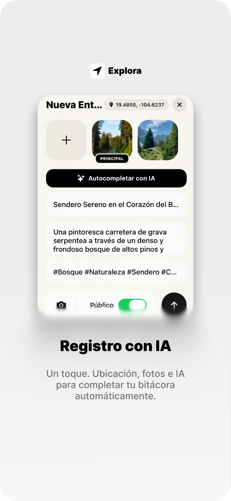
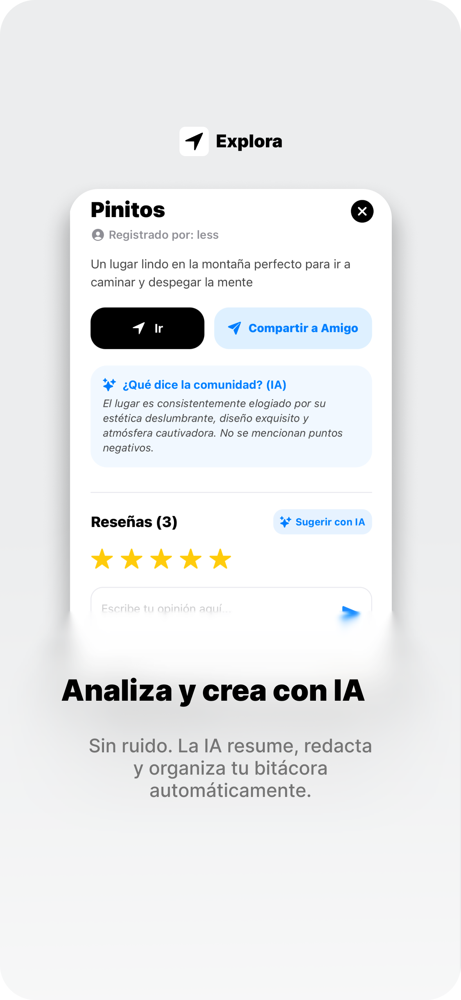
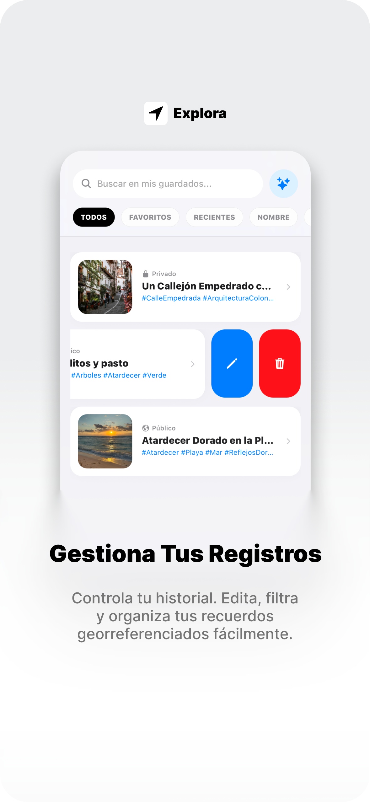
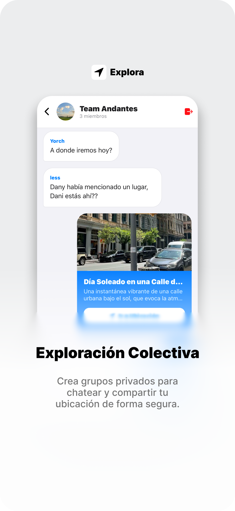
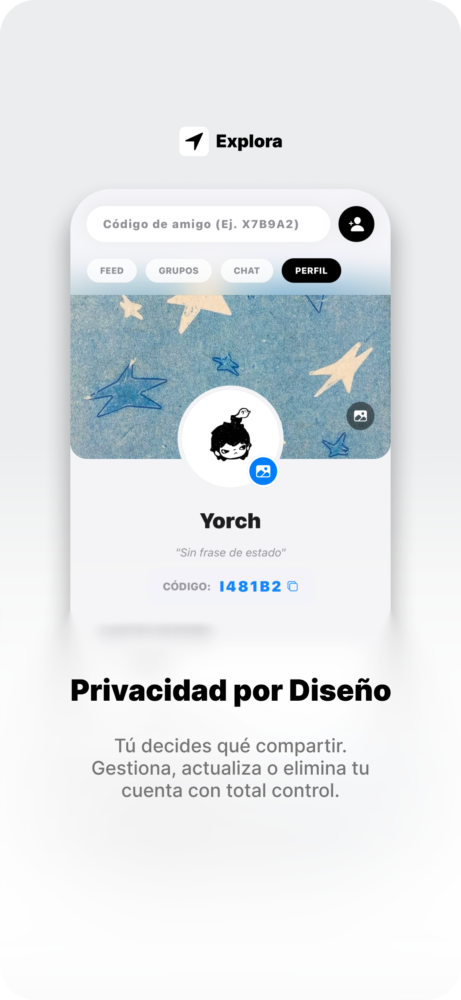

<div align="center">

# 🌍 Explora

### Plataforma móvil de exploración social basada en geolocalización, comunidad y descubrimiento de lugares





</div>

---

# 📌 Descripción General

## Introducción

**Explora** es una aplicación móvil desarrollada para transformar la manera en que los usuarios descubren, guardan y comparten lugares de interés mediante una experiencia social inmersiva basada en geolocalización en tiempo real.

La plataforma integra funcionalidades modernas como:

- 📍 Geolocalización GPS
- 🗺️ Visualización interactiva en mapas
- 📸 Registro multimedia de ubicaciones
- 💬 Chat en tiempo real
- 👥 Grupos y comunidades
- 🔔 Sistema de notificaciones
- ❤️ Feed social colaborativo
- 🔖 Sistema de guardados y favoritos

El objetivo principal de la aplicación es centralizar la experiencia de exploración urbana y social en un único ecosistema digital, permitiendo que los usuarios documenten experiencias, interactúen con comunidades y descubran contenido contextual basado en ubicación.

---

# 🚀 Propuesta de Valor

Explora combina:

| Capacidad                   | Valor generado                         |
| --------------------------- | -------------------------------------- |
| Geolocalización inteligente | Descubrimiento contextual de lugares   |
| Sistema social integrado    | Interacción comunitaria en tiempo real |
| Registro multimedia         | Experiencias visuales enriquecidas     |
| Arquitectura móvil moderna  | Fluidez y escalabilidad                |
| Interfaz intuitiva          | Experiencia de usuario optimizada      |

---

# 🎯 Pitch Visual

## Flujo Inicial de Usuario

### 1. Inicio y exploración del ecosistema


La aplicación presenta una interfaz moderna centrada en el descubrimiento visual de lugares y contenido social contextual.

---

### 2. Descubrimiento de ubicaciones


Los usuarios pueden navegar por ubicaciones registradas mediante tarjetas dinámicas con información geográfica y visual.

---

### 3. Sistema de interacción social


Explora incorpora una experiencia social integrada mediante chats, publicaciones y comunidades colaborativas.

---

### 4. Gestión personalizada de contenido



La plataforma permite guardar ubicaciones favoritas y administrar contenido personalizado.

---

### 5. Experiencia geoespacial avanzada



El sistema de mapas interactivos facilita la visualización espacial y navegación contextual de lugares registrados.

---

# 🧠 Arquitectura Funcional del Sistema

# ⚙️ Características y Capacidades

## 📍 Sistema de Geolocalización GPS

### Capacidades

- Obtención de ubicación en tiempo real
- Detección de coordenadas geográficas
- Registro automático de lugares
- Visualización de mapas interactivos
- Navegación contextual basada en proximidad

### Funcionalidades técnicas

- Integración con servicios de localización del dispositivo
- Manejo de permisos GPS
- Actualización dinámica de coordenadas
- Renderizado de marcadores geográficos

---

## 🗺️ Módulo de Mapas Interactivos

### Capacidades

- Visualización geoespacial de lugares
- Marcadores personalizados
- Navegación visual contextual
- Interacción táctil avanzada

### Funcionalidades técnicas

- Renderizado de mapas dinámicos
- Sincronización con datos de ubicación
- Gestión de capas geográficas
- Actualización en tiempo real

---

## 📸 Integración con Cámara

### Capacidades

- Captura de imágenes desde la aplicación
- Registro visual de ubicaciones
- Publicación multimedia

### Funcionalidades técnicas

- Acceso nativo a cámara
- Manejo de permisos multimedia
- Procesamiento de imágenes
- Asociación de contenido visual con ubicaciones

---

## 💬 Sistema de Chat en Tiempo Real

### Capacidades

- Comunicación instantánea
- Conversaciones privadas y grupales
- Sincronización en tiempo real

### Funcionalidades técnicas

- Renderizado dinámico de mensajes
- Gestión de sesiones de usuario
- Actualización reactiva de conversaciones
- Arquitectura basada en eventos

---

## 👥 Sistema Social y Comunidades

### Capacidades

- Creación de grupos
- Feed social colaborativo
- Publicaciones sociales
- Interacciones comunitarias

### Funcionalidades técnicas

- Gestión de relaciones sociales
- Persistencia de publicaciones
- Actualización dinámica de feeds
- Arquitectura modular social

---

## 🔖 Sistema de Guardados

### Capacidades

- Guardar ubicaciones favoritas
- Organización personalizada
- Acceso rápido a contenido

### Funcionalidades técnicas

- Persistencia local/remota
- Sincronización de favoritos
- Gestión de estados

---

## 🔐 Sistema de Autenticación

### Capacidades

- Registro de usuarios
- Inicio de sesión
- Gestión de perfiles

### Funcionalidades técnicas

- Manejo seguro de credenciales
- Persistencia de sesión
- Validaciones de autenticación

---

## 🔔 Sistema de Notificaciones

### Capacidades

- Alertas en tiempo real
- Eventos contextuales
- Actualizaciones sociales

### Funcionalidades técnicas

- Integración con servicios push
- Gestión de eventos asincrónicos
- Sistema reactivo de alertas

---

# 🧱 Stack Tecnológico

## Tecnologías Principales

| Categoría        | Tecnología                    | Propósito                           |
| ---------------- | ----------------------------- | ----------------------------------- |
| Lenguaje         | TypeScript                    | Tipado seguro y escalabilidad       |
| Framework Mobile | React Native                  | Desarrollo móvil multiplataforma    |
| Framework        | Expo                          | Simplificación del ecosistema móvil |
| Navegación       | Expo Router                   | Routing modular y navegación        |
| UI               | React Native Components       | Interfaz multiplataforma            |
| Backend Services | Firebase                      | Persistencia y sincronización       |
| Base de Datos    | Firestore                     | Base de datos en tiempo real        |
| Autenticación    | Firebase Auth                 | Gestión de usuarios                 |
| Geolocalización  | Expo Location                 | Servicios GPS                       |
| Cámara           | Expo Camera                   | Captura multimedia                  |
| Mapas            | React Native Maps             | Visualización geográfica            |
| Estado           | React Hooks / Context API     | Manejo global de estado             |
| Notificaciones   | Expo Notifications            | Sistema push                        |
| Tiempo Real      | Firebase Realtime / Firestore | Chat y sincronización               |
| Iconografía      | Expo Vector Icons             | Componentes visuales                |
| Estilos          | StyleSheet API                | Diseño responsive                   |

---

# 🧩 Justificación Tecnológica

## React Native + Expo

Seleccionados por:

- Desarrollo cross-platform
- Alto rendimiento móvil
- Ecosistema maduro
- Iteración rápida
- Integración sencilla con APIs nativas

---

## Firebase

Elegido por:

- Arquitectura serverless
- Sincronización en tiempo real
- Escalabilidad inmediata
- Integración rápida con apps móviles
- Autenticación integrada

---

## TypeScript

Implementado para:

- Mayor mantenibilidad
- Reducción de errores
- Escalabilidad empresarial
- Tipado estático

---

# 🎬 Showcase y Demos

# 📱 Vista Explorar

https://github.com/user-attachments/assets/b0e5328b-190c-489c-a876-72e4d82a2619

### Flujo

1. El usuario accede al feed de exploración
2. El sistema obtiene ubicaciones disponibles
3. Se renderizan tarjetas dinámicas
4. El usuario interactúa con lugares y contenido

---

# 🔖 Vista Guardados

https://github.com/user-attachments/assets/d528b2ce-7640-4ff0-b60f-0200b0600ad1

### Flujo

1. El usuario guarda ubicaciones
2. El sistema persiste información
3. Se sincronizan favoritos
4. El usuario consulta contenido guardado

---

# 🗺️ Vista Mapa

https://github.com/user-attachments/assets/fbb26dad-3450-477a-a17d-e2f0c0834084

### Flujo

1. Se inicializa el GPS
2. El sistema obtiene coordenadas
3. Se renderiza el mapa interactivo
4. Los lugares aparecen mediante marcadores

---

# 🔐 Registro, Perfil y Login

https://github.com/user-attachments/assets/da0ef8be-6e39-41d3-a457-4b753eaa3261

### Flujo

1. Registro de usuario
2. Validación de credenciales
3. Inicio de sesión seguro
4. Acceso al perfil personalizado

---

# 💬 Social Section — Chat

https://github.com/user-attachments/assets/7420eef8-d7e4-4428-9fa8-b16ad14ad3b9

### Flujo

1. Apertura de conversación
2. Envío de mensajes
3. Sincronización en tiempo real
4. Actualización instantánea de interfaz

---

# 📰 Social Section — Feed

https://github.com/user-attachments/assets/786773f0-1504-4055-830e-221ee79fa483

### Flujo

1. Publicación de contenido
2. Renderizado dinámico del feed
3. Interacción social
4. Actualización colaborativa

---

# 👥 Social Section — Grupos

https://github.com/user-attachments/assets/907d5074-f896-4922-9e1e-22e24b964c2d

### Flujo

1. Creación de grupos
2. Unión de usuarios
3. Compartición de contenido
4. Comunicación comunitaria

---

# 🧪 Especificaciones Técnicas

# 📋 Requisitos del Sistema

| Requisito         | Especificación                     |
| ----------------- | ---------------------------------- |
| Sistema Operativo | Android / iOS                      |
| RAM Recomendada   | 4 GB o superior                    |
| GPS               | Requerido                          |
| Cámara            | Requerida                          |
| Internet          | Requerido                          |
| Sensores          | Geolocalización activa             |
| Permisos          | Cámara, ubicación y notificaciones |

---

# 🔌 Integraciones de Hardware

## 📍 GPS

Utilizado para:

- Detección geográfica
- Navegación contextual
- Registro de ubicaciones

---

## 📸 Cámara

Utilizada para:

- Captura multimedia
- Registro visual
- Publicaciones sociales

---

## 🔔 Sistema de Notificaciones

Utilizado para:

- Alertas en tiempo real
- Eventos sociales
- Actualizaciones dinámicas

---

# 📂 Estructura General del Proyecto

```bash
Explora/
│
├── app/
├── assets/
├── components/
├── hooks/
├── services/
├── constants/
├── utils/
├── contexts/
├── firebase/
└── types/
```

