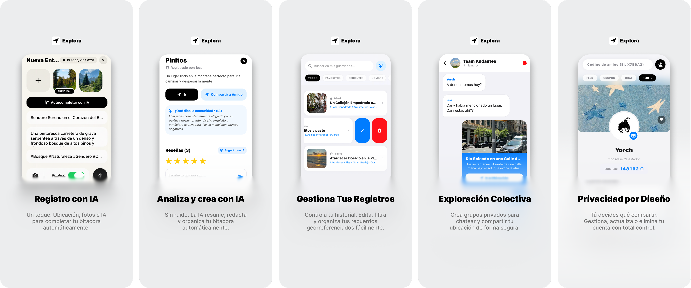
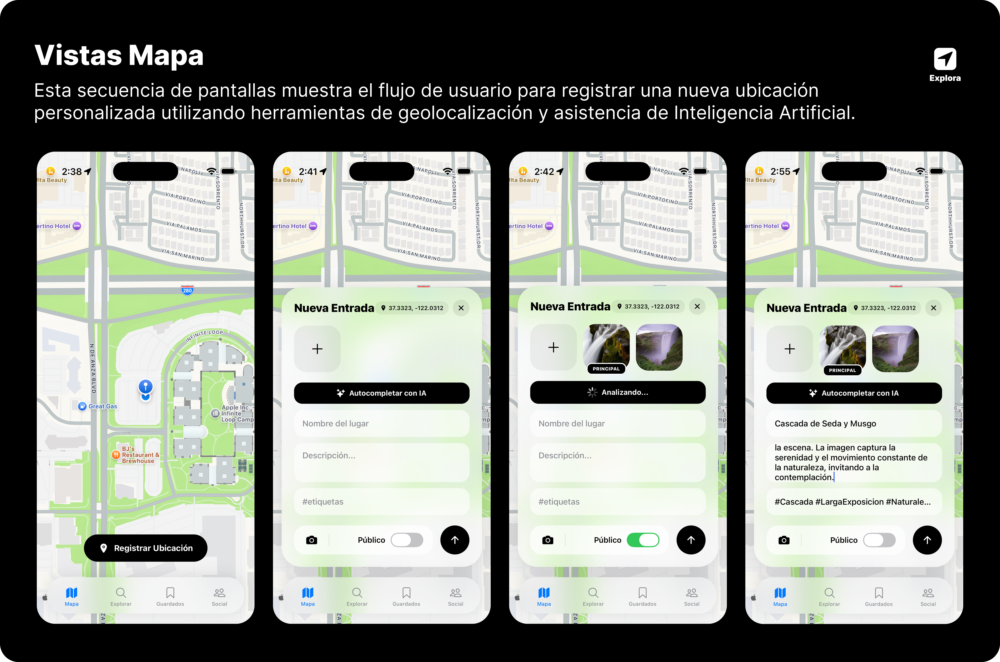
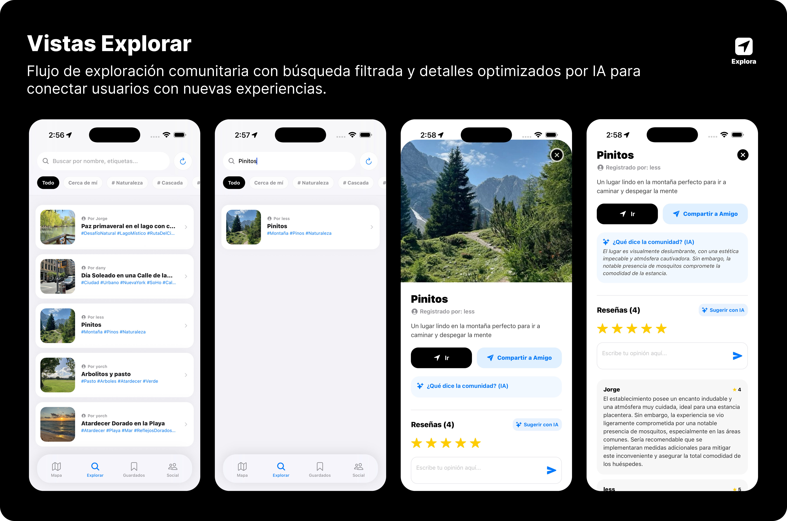
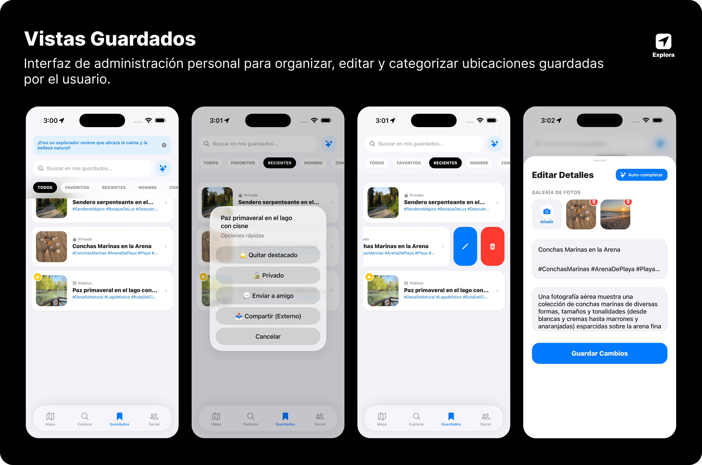

---
<div align="center">

</div>
---

<div align="center">


</div>

## Introducción

<div align="justify">

**Explora** es una aplicación móvil desarrollada para transformar la manera en que los usuarios descubren, guardan y comparten lugares de interés mediante una experiencia social inmersiva basada en geolocalización en tiempo real e inteligencia artificial.

La plataforma integra funcionalidades modernas como:

- Geolocalización GPS
- Visualización interactiva en mapas
- Registro multimedia de ubicaciones
- Reseñas, resumenes, edicion y analisis inteligente impulsado por IA
- Chat en tiempo real
- Grupos y comunidades
- Feed social colaborativo
- Sistema de guardados y favoritos

El objetivo principal de la aplicación es centralizar la experiencia de exploración urbana y social en un único ecosistema digital, permitiendo que los usuarios documenten experiencias, interactúen con comunidades y descubran contenido contextual basado en ubicación y asistido por IA.

</div>

---

## Propuesta de Valor

---

<div align="justify">

**Explora** redefine la forma en que interactuamos con nuestro entorno mediante la convergencia de **geolocalización inteligente** y un **sistema social integrado**, permitiendo un descubrimiento contextual de lugares con interacción comunitaria en tiempo real. Gracias a su capacidad de **registro multimedia**, los usuarios disfrutan de experiencias visuales enriquecidas bajo una **arquitectura móvil** moderna que garantiza fluidez, escalabilidad y una experiencia de usuario optimizada a través de una **interfaz intuitiva**.

</div>

---

## Pitch Visual

---

<div align="center">

</div>

<br />

<div align="justify">
  <h3> Vista Mapa: Flujo de Registro Inteligente</h2>
  <p>
    El núcleo de <strong>Explora</strong> es la capacidad de transformar coordenadas geográficas en historias visuales con el mínimo esfuerzo del usuario. A continuación, se detalla el flujo de trabajo integrado en la vista de mapa:
  </p>

  <h4>1. Ubicación y Contexto</h4>
  <p>
    El usuario interactúa con un mapa de alta precisión (estética minimalista) para identificar su posición actual o un punto de interés. Al seleccionar una ubicación, el sistema activa el botón dinámico de <b>"Registrar Ubicación"</b>, capturando las coordenadas exactas de forma automática.
  </p>

  <h4>2. Formulario Dinámico con BlurView</h4>
  <p>
    Al iniciar el registro, se despliega una interfaz de usuario optimizada mediante una tarjeta con efecto de desenfoque (<i>glassmorphism</i>). Este panel organiza la información técnica y los campos creativos:
  </p>
  <ul>
    <li><strong>Nombre y Descripción:</strong> Espacios para la personalización del usuario.</li>
    <li><strong>Gestión Multimedia:</strong> Selector de imágenes para documentar la experiencia.</li>
    <li><strong>Control de Privacidad:</strong> Interruptor nativo para decidir la visibilidad de la publicación.</li>
  </ul>

  <h4>3. Autocompletado con IA (Multimodal)</h4>
  <p>
    Mediante la integración con <b>Gemini AI</b>, el sistema ofrece un análisis automático de las fotografías:
  </p>
  <ul>
    <li><strong>Visión Computacional:</strong> Identificación de elementos clave (paisajes, flora, monumentos).</li>
    <li><strong>Generación de Contenido:</strong> Redacción automática de nombres creativos y descripciones detalladas.</li>
    <li><strong>Clasificación Inteligente:</strong> Generación de <i>#Hashtags</i> para facilitar la búsqueda y escalabilidad.</li>
  </ul>

  <h4>4. Publicación y Sincronización</h4>
  <p>
    Una vez validado, el registro se sincroniza con <b>Firebase Firestore</b>, apareciendo instantáneamente en el feed social y en la bitácora personal, garantizando fluidez bajo una arquitectura móvil moderna.
  </p>
</div>

<br />

---

<br />

<div align="center">

</div>

<br />

<div align="justify">
  <h3>Vista Explorar: Descubrimiento y Conexión Comunitaria</h3>
  <p>
    La sección <strong>Explorar</strong> actúa como el motor de descubrimiento de la plataforma, permitiendo a los usuarios conectar con experiencias compartidas por la comunidad a través de herramientas de búsqueda avanzada y análisis semántico. A continuación, se detalla el flujo de exploración:
  </p>

  <h4>1. Búsqueda y Filtrado Inteligente</h4>
  <p>
    La interfaz presenta un buscador global optimizado para nombres, categorías o etiquetas. Se implementa un sistema de <b>filtros rápidos (Chips)</b> que permiten segmentar resultados de forma instantánea: desde ubicaciones "Cerca de mí" hasta categorías específicas como #Naturaleza o #Cascada, facilitando una navegación fluida entre miles de registros.
  </p>

  <h4>2. Visualización de Resultados Dinámica</h4>
  <p>
    Los resultados se despliegan en una lista de tarjetas interactivas que priorizan el contenido visual. Cada tarjeta ofrece un resumen ejecutivo del lugar: nombre del autor, imagen destacada y hashtags principales. Esta arquitectura permite al usuario evaluar rápidamente los puntos de interés antes de profundizar en los detalles.
  </p>

  <h4>3. Análisis Semántico con IA (Gemini AI)</h4>
  <p>
    Al seleccionar un lugar, <b>Explora</b> utiliza Inteligencia Artificial para procesar el sentimiento colectivo. La funcionalidad <b>"¿Qué dice la comunidad? (IA)"</b> analiza todas las reseñas de los usuarios para generar un resumen inteligente, extrayendo los puntos positivos y las advertencias relevantes, ahorrando al usuario la lectura de decenas de comentarios individuales.
  </p>

  <h4>4. Interacción y Reseñas Multimodales</h4>
  <p>
    La vista detallada permite al usuario iniciar navegación directa (botón "Ir") o compartir el hallazgo con amigos. El sistema de <b>Reseñas</b> permite una interacción bidireccional donde los usuarios califican con estrellas y texto, contando además con asistencia de IA para <b>"Sugerir opinión"</b>, optimizando la participación social dentro del ecosistema.
  </p>
</div>

<br />

---

<br />

<div align="center">

</div>
<br />

<div align="justify">
  <h3>Vista Guardados: Gestión y Organización Personal</h3>
  <p>
    La sección <strong>Guardados</strong> constituye la bitácora personal del usuario, ofreciendo una interfaz robusta para administrar el historial de exploraciones, personalizar la privacidad y organizar los hallazgos mediante herramientas de gestión avanzada.
  </p>

  <h4>1. Organización y Filtrado de Bitácora</h4>
  <p>
    El usuario dispone de una biblioteca centralizada con todas sus ubicaciones registradas. Se implementa un sistema de <b>filtros inteligentes (Recientes, Favoritos, Nombre, Zona)</b> que permite localizar entradas específicas de forma ágil, permitiendo al explorador tener un control total sobre su patrimonio de viajes.
  </p>

  <h4>2. Acceso Rápido y Menú Contextual</h4>
  <p>
    Mediante una pulsación prolongada (<i>Long Press</i>), se despliega un menú de <b>Opciones Rápidas</b> con efecto de desenfoque. Desde aquí, el usuario puede alternar instantáneamente entre estados de "Destacado", modificar la visibilidad (Público/Privado), enviar el lugar a un amigo o realizar una exportación compartida externa.
  </p>

  <h4>3. Interacciones por Deslizamiento (Swipe Actions)</h4>
  <p>
    Optimizando la experiencia en dispositivos móviles, se han integrado <b>Swipe Actions</b> intuitivos en cada tarjeta. Deslizar hacia la izquierda revela botones de acción directa: un acceso rápido para <b>Editar</b> los detalles del lugar y un botón de <b>Eliminar</b> con confirmación, permitiendo una limpieza de bitácora rápida y fluida.
  </p>

  <h4>4. Edición Avanzada con Soporte de IA</h4>
  <p>
    La vista de edición permite modificar la galería de fotos y actualizar la narrativa de la entrada. Se mantiene la integración con <b>Gemini AI</b> mediante el botón "Auto-completar", permitiendo al usuario regenerar o pulir la descripción y hashtags del lugar basándose en las imágenes actuales, asegurando que cada registro mantenga una calidad profesional.
  </p>
</div>

<br />

<div align="center">

</div>

<br />

<div align="justify">
  <h3>Vista Social: Ecosistema Colaborativo y Comunidad</h3>
  <p>
    La sección <strong>Social</strong> constituye el núcleo de interacción de la plataforma. Está diseñada bajo una arquitectura de pestañas dinámicas que facilita la gestión de grupos, la comunicación directa y la personalización de la identidad digital del explorador.
  </p>

  <h4>1. Feed Comunitario e Interacción</h4>
  <p>
    El <b>Feed</b> presenta una línea de tiempo fluida con las recomendaciones de la comunidad. Cada publicación integra un motor de interacción social que permite reaccionar, comentar y compartir. Se incluye un acceso directo de <b>Geolocalización</b> ("Ir a ubicación") que vincula el contenido social con el mapa interactivo, cerrando el ciclo de descubrimiento.
  </p>

  <h4>2. Gestión de Grupos y Comunidades</h4>
  <p>
    El módulo de <b>Grupos</b> permite a los usuarios unirse a comunidades existentes o fundar nuevas. Se implementa un sistema de validación donde el botón de acción cambia dinámicamente de "Unirse" a "Abrir" según el estado de pertenencia. Cada comunidad cuenta con un identificador único (<i>Cód.</i>) para facilitar el crecimiento orgánico mediante invitaciones directas.
  </p>

  <h4>3. Centro de Mensajería y Conexiones</h4>
  <p>
    La pestaña de <b>Chat</b> centraliza la comunicación privada y grupal. Se organiza en dos niveles: una fila superior de <b>Acceso Rápido a Grupos</b> para una navegación ágil y una lista vertical de <b>Conexiones Personales</b>. La interfaz utiliza indicadores visuales de estado y previsualizaciones de mensajes para mejorar la retención y el engagement.
  </p>

  <h4>4. Identidad Visual y Perfil de Usuario</h4>
  <p>
    La sección de <b>Perfil</b> ofrece un panel de configuración estética y técnica. Los usuarios pueden personalizar su avatar, banner de encabezado y biografía. Además, se integra un generador de <b>Código de Amigo Único</b> con función de copiado rápido, permitiendo que la red social se expanda mediante la vinculación directa entre exploradores.
  </p>
</div>

<br />

---

## Arquitectura Funcional del Sistema

## Características y Capacidades

## Sistema de Geolocalización GPS

### Capacidades

- Obtención de ubicación en tiempo real
- Detección de coordenadas geográficas
- Registro automático de lugares
- Visualización de mapas interactivos
- Navegación contextual basada en proximidad

### Funcionalidades técnicas

- Integración con servicios de localización del dispositivo
- Manejo de permisos GPS
- Actualización dinámica de coordenadas
- Renderizado de marcadores geográficos

---

## 🗺️ Módulo de Mapas Interactivos

### Capacidades

- Visualización geoespacial de lugares
- Marcadores personalizados
- Navegación visual contextual
- Interacción táctil avanzada

### Funcionalidades técnicas

- Renderizado de mapas dinámicos
- Sincronización con datos de ubicación
- Gestión de capas geográficas
- Actualización en tiempo real

---

## 📸 Integración con Cámara

### Capacidades

- Captura de imágenes desde la aplicación
- Registro visual de ubicaciones
- Publicación multimedia

### Funcionalidades técnicas

- Acceso nativo a cámara
- Manejo de permisos multimedia
- Procesamiento de imágenes
- Asociación de contenido visual con ubicaciones

---

## 💬 Sistema de Chat en Tiempo Real

### Capacidades

- Comunicación instantánea
- Conversaciones privadas y grupales
- Sincronización en tiempo real

### Funcionalidades técnicas

- Renderizado dinámico de mensajes
- Gestión de sesiones de usuario
- Actualización reactiva de conversaciones
- Arquitectura basada en eventos

---

## 👥 Sistema Social y Comunidades

### Capacidades

- Creación de grupos
- Feed social colaborativo
- Publicaciones sociales
- Interacciones comunitarias

### Funcionalidades técnicas

- Gestión de relaciones sociales
- Persistencia de publicaciones
- Actualización dinámica de feeds
- Arquitectura modular social

---

## 🔖 Sistema de Guardados

### Capacidades

- Guardar ubicaciones favoritas
- Organización personalizada
- Acceso rápido a contenido

### Funcionalidades técnicas

- Persistencia local/remota
- Sincronización de favoritos
- Gestión de estados

---

## 🔐 Sistema de Autenticación

### Capacidades

- Registro de usuarios
- Inicio de sesión
- Gestión de perfiles

### Funcionalidades técnicas

- Manejo seguro de credenciales
- Persistencia de sesión
- Validaciones de autenticación

---

## 🔔 Sistema de Notificaciones

### Capacidades

- Alertas en tiempo real
- Eventos contextuales
- Actualizaciones sociales

### Funcionalidades técnicas

- Integración con servicios push
- Gestión de eventos asincrónicos
- Sistema reactivo de alertas

---

# 🧱 Stack Tecnológico

## Tecnologías Principales

| Categoría        | Tecnología                    | Propósito                           |
| ---------------- | ----------------------------- | ----------------------------------- |
| Lenguaje         | TypeScript                    | Tipado seguro y escalabilidad       |
| Framework Mobile | React Native                  | Desarrollo móvil multiplataforma    |
| Framework        | Expo                          | Simplificación del ecosistema móvil |
| Navegación       | Expo Router                   | Routing modular y navegación        |
| UI               | React Native Components       | Interfaz multiplataforma            |
| Backend Services | Firebase                      | Persistencia y sincronización       |
| Base de Datos    | Firestore                     | Base de datos en tiempo real        |
| Autenticación    | Firebase Auth                 | Gestión de usuarios                 |
| Geolocalización  | Expo Location                 | Servicios GPS                       |
| Cámara           | Expo Camera                   | Captura multimedia                  |
| Mapas            | React Native Maps             | Visualización geográfica            |
| Estado           | React Hooks / Context API     | Manejo global de estado             |
| Notificaciones   | Expo Notifications            | Sistema push                        |
| Tiempo Real      | Firebase Realtime / Firestore | Chat y sincronización               |
| Iconografía      | Expo Vector Icons             | Componentes visuales                |
| Estilos          | StyleSheet API                | Diseño responsive                   |

---

# 🧩 Justificación Tecnológica

## React Native + Expo

Seleccionados por:

- Desarrollo cross-platform
- Alto rendimiento móvil
- Ecosistema maduro
- Iteración rápida
- Integración sencilla con APIs nativas

---

## Firebase

Elegido por:

- Arquitectura serverless
- Sincronización en tiempo real
- Escalabilidad inmediata
- Integración rápida con apps móviles
- Autenticación integrada

---

## TypeScript

Implementado para:

- Mayor mantenibilidad
- Reducción de errores
- Escalabilidad empresarial
- Tipado estático

---

# 🎬 Showcase y Demos

## 📱 Demostración de la App

### 🔐 Acceso y Perfil

|                                          Registro, Perfil y Login                                           |
| :---------------------------------------------------------------------------------------------------------: |
| <video src="https://github.com/user-attachments/assets/da0ef8be-6e39-41d3-a457-4b753eaa3261" width="250" /> |

---

### 🌍 Exploración y Mapa

|                                               Vista Explorar                                                |                                               Vista Guardados                                               |                                                 Vista Mapa                                                  |
| :---------------------------------------------------------------------------------------------------------: | :---------------------------------------------------------------------------------------------------------: | :---------------------------------------------------------------------------------------------------------: |
| <video src="https://github.com/user-attachments/assets/b0e5328b-190c-489c-a876-72e4d82a2619" width="200" /> | <video src="https://github.com/user-attachments/assets/d528b2ce-7640-4ff0-b60f-0200b0600ad1" width="200" /> | <video src="https://github.com/user-attachments/assets/fbb26dad-3450-477a-a17d-e2f0c0834084" width="200" /> |

---

### 💬 Sección Social

|                                                Chat en Vivo                                                 |                                              Feed de Noticias                                               |                                             Grupos Comunitarios                                             |
| :---------------------------------------------------------------------------------------------------------: | :---------------------------------------------------------------------------------------------------------: | :---------------------------------------------------------------------------------------------------------: |
| <video src="https://github.com/user-attachments/assets/7420eef8-d7e4-4428-9fa8-b16ad14ad3b9" width="200" /> | <video src="https://github.com/user-attachments/assets/786773f0-1504-4055-830e-221ee79fa483" width="200" /> | <video src="https://github.com/user-attachments/assets/907d5074-f896-4922-9e1e-22e24b964c2d" width="200" /> |

# 🧪 Especificaciones Técnicas

# 📋 Requisitos del Sistema

| Requisito         | Especificación                     |
| ----------------- | ---------------------------------- |
| Sistema Operativo | Android / iOS                      |
| RAM Recomendada   | 4 GB o superior                    |
| GPS               | Requerido                          |
| Cámara            | Requerida                          |
| Internet          | Requerido                          |
| Sensores          | Geolocalización activa             |
| Permisos          | Cámara, ubicación y notificaciones |

---

# 🔌 Integraciones de Hardware

## 📍 GPS

Utilizado para:

- Detección geográfica
- Navegación contextual
- Registro de ubicaciones

---

## 📸 Cámara

Utilizada para:

- Captura multimedia
- Registro visual
- Publicaciones sociales

---

## 🔔 Sistema de Notificaciones

Utilizado para:

- Alertas en tiempo real
- Eventos sociales
- Actualizaciones dinámicas

---

# 📂 Estructura General del Proyecto

```bash
Explora/
│
├── app/
├── assets/
├── components/
├── hooks/
├── services/
├── constants/
├── utils/
├── contexts/
├── firebase/
└── types/
```
